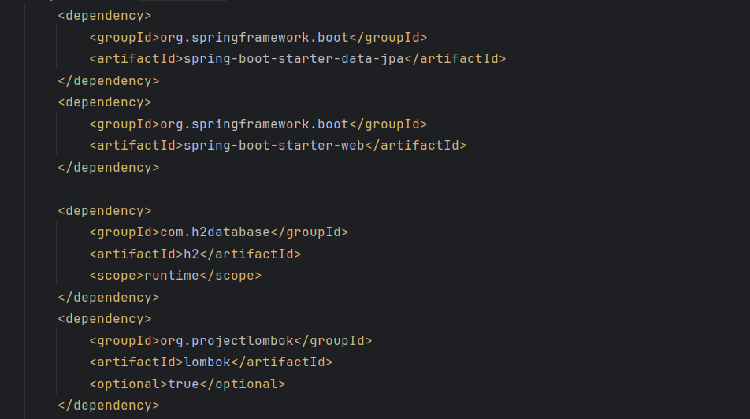
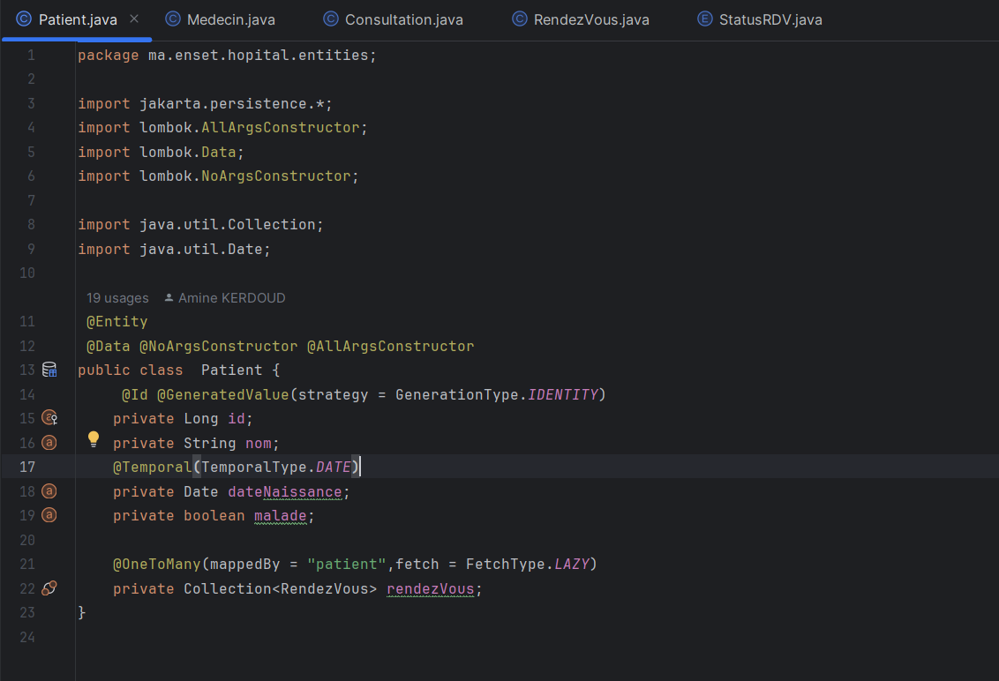
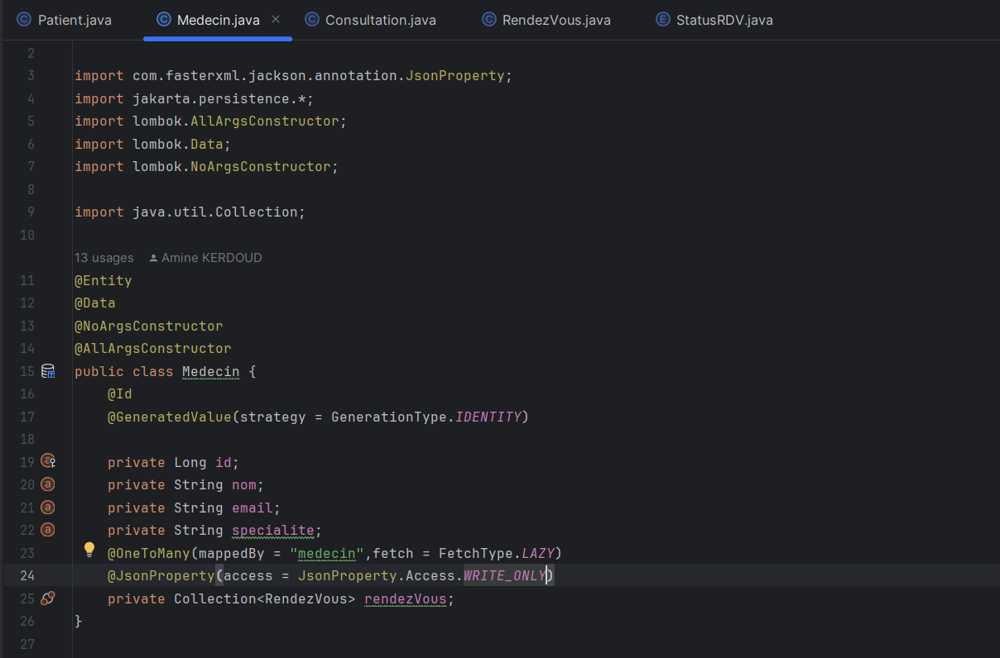
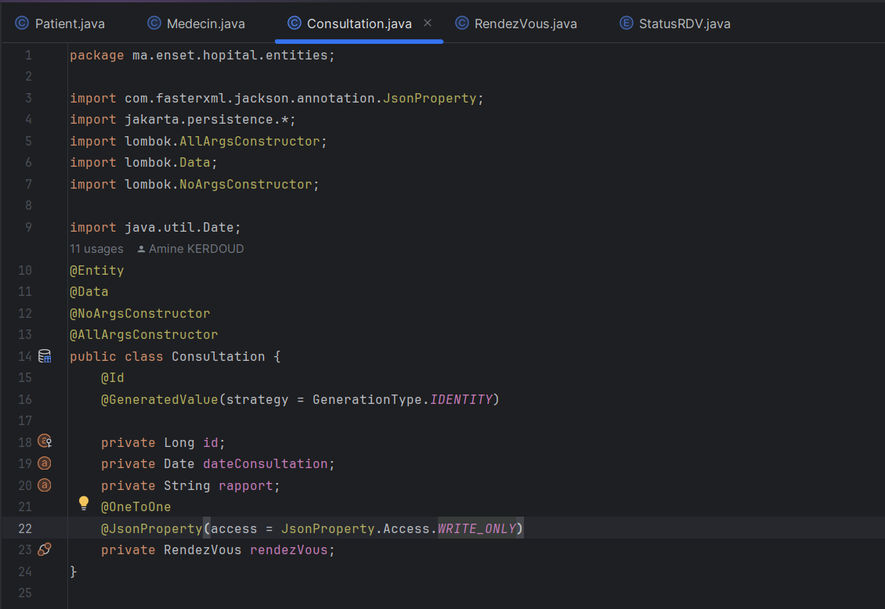
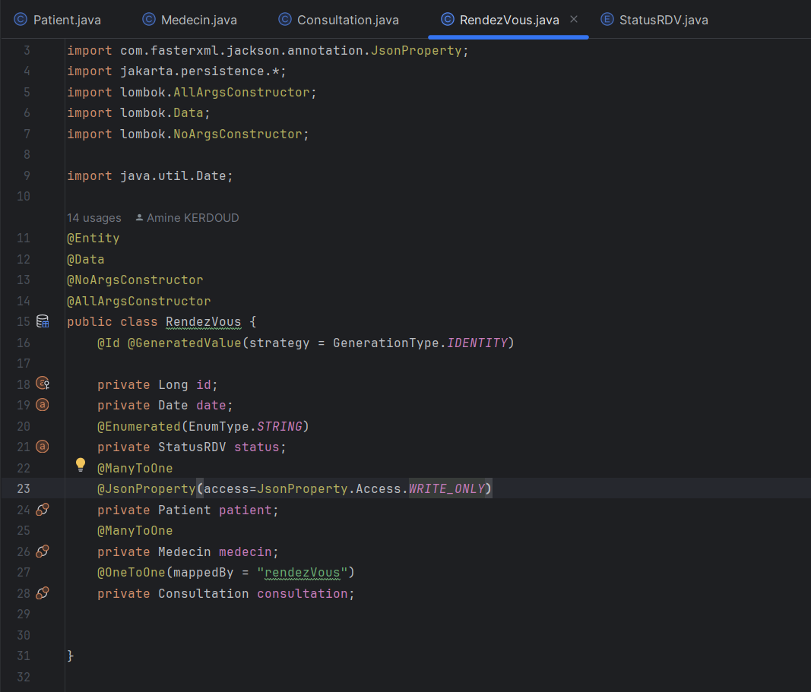
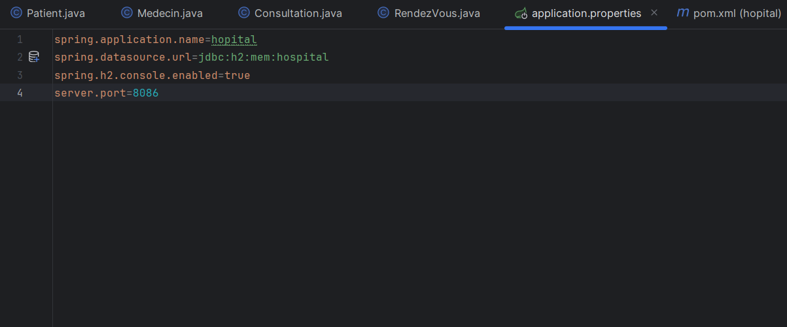
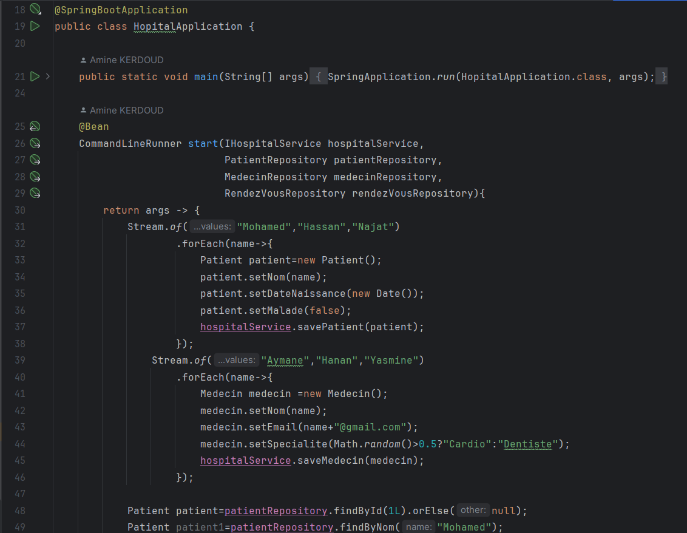
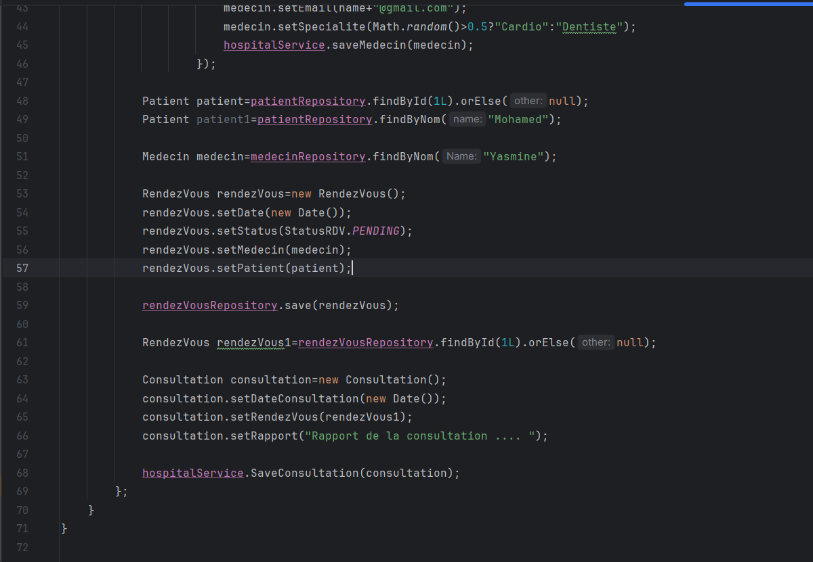
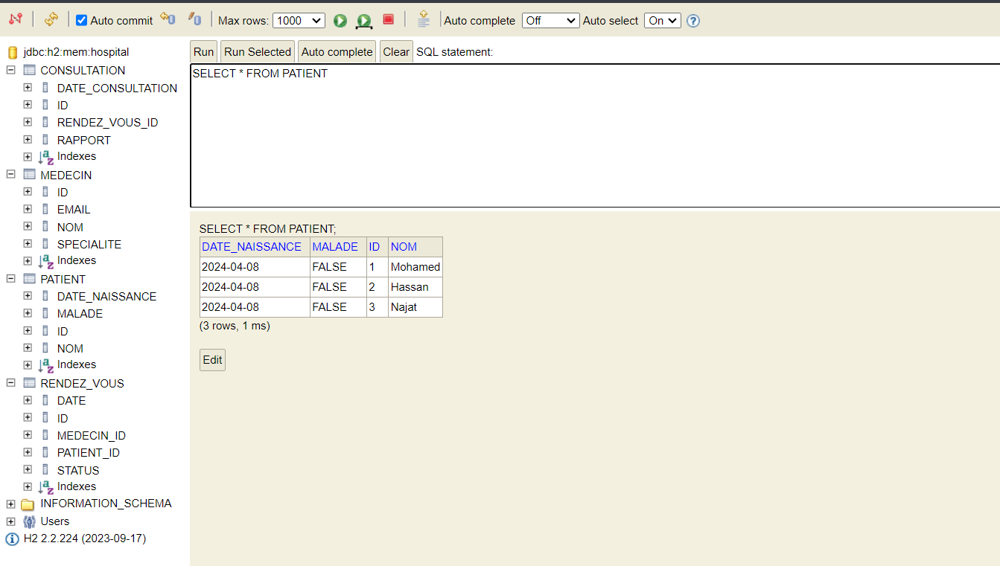

<h3>Compte rendu<h3>

<h4>1-Les dépendances JPA, H2, Spring Web et Lombock</h4>

<h4>2 -L'entité Patient</h4>

<h4>-L'entité Medecin</h4>

<h4>-L'entité Consultation</h4>

<h4>-L'entité Rendez Vous</h4>

<h4>3-L'application.properties </h4>

<h4>4-HopitalApllication</h4>

<h4>5-La base de donnees Hopital </h4>
